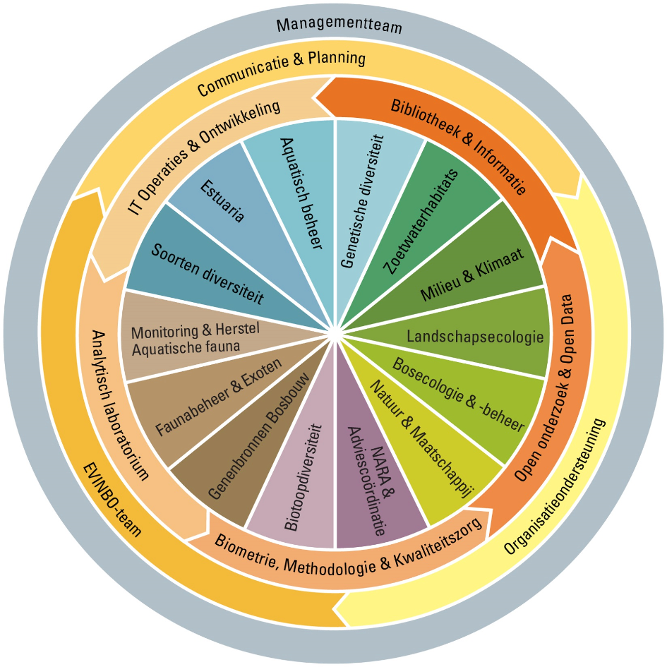

```{r include = FALSE}
library(knitr)
opts_chunk$set(
  echo = FALSE
)
library(lme4)
library(dplyr)
library(ggplot2)
library(INBOtheme)
theme_set(theme_vlaanderen2015(6))
update_geom_defaults("point", list(size = 0.5))
update_geom_defaults("line", list(size = 0.2))
```

```{r}
staff <- 262
admin <- 31
wo <- c(BMK = 8, Data = 8, ICT = 6, Lab = 10, Bib = 8)
science <- staff - admin - sum(wo)
```

# INBO

## INBO

- Instituut voor Natuur- en Bosonderzoek / Research Institute for Nature and Forest
- Flemish research and knowledge centre for nature and its sustainable management and use
- conducts research and supplies knowledge to policy makers and stakeholders
- supports
    - agencies of Flemish government related with countryside or nature within urban areas
    - organisations involved in nature conservation, forestry, agriculture, hunting and fishery

## Data collection and provision

- INBO collects and provides data for international reporting
- Participates in (inter)national research networks
    - [LTER](https://lternet.edu): the Long Term Ecological Research network
    - [LifeWatch](http://www.lifewatch.eu): e-Science and Technology European Infrastructure for Biodiversity and Ecosystem Research 
    - [ALTER-Net](http://www.alter-net.info): A Long-Term Biodiversity, Ecosystem and Awareness Research Network
    - ...

## Organigram



## Staff

- `r staff` staff
    - `r science` scientific staff (scientists + technicians)
    - `r sum(wo)` support for scientific staff
    - `r admin` management + administrative staff
- 5 specialised teams dedicated to support the scientific staff
    1. Biometry, Methodology & Quality assurance (`r wo["BMK"]`)
    1. Open data & open research (`r wo["Data"]`)
    1. Laboratory  (`r wo["Lab"]`)
    1. IT operations & development  (`r wo["ICT"]`)
    1. Library  (`r wo["Bib"]`)

# Biometry, Methodology & Quality assurance

## A scientific corporate identity and quality assurance

- involvement from design phase up to implementation phase
- creating, evaluating and adjusting procedures
    - harmonising protocols for data collection
    - validation of data through statistical modelling
- improving reproducibility
    - scripted analysis (R)
    - dynamic documents (RMarkdown)
    - version control (git)
- gradual change!
    - focus on early adopters and early majority
    - stimulation and support is vital
    - new procedures should lower the burden in the long run
    - allow for a long transition period before enforcing change

## Creating a methodological platform

- maintaining tools
    - software, manuals, documentation, books, ...
    - templates for basic analyses
    - corporate identity styles for graphics (ggplot2) and dynamics documents (markdown, LaTeX, HTML)
- implementing methodologies
    - standardise methods and analyses with focus on long term monitoring and common experiments
    - testing new methods and analysis techniques
    - developing new methods and analysis techniques
- improving self-reliance of scientists
    - internal statistics courses ranging from "stats 101" to generalised linear mixed models
    - offer scientists tools to help themselves and each other: websites, webinars, books, ...
    
## Leading specific projects

Some projects are led by the team, in collaboration with scientists. These projects typically:

- have more statistical or technological challenges
- strive towards achieving higher quality and standardization levels at INBO
- have a longer term

Examples:

- design and implementation of monitoring networks to support and evaluate Natura 2000 objectives
- design and implementation of monitoring of nature management plans
- elaboration of population modelling methods

## Support and services

- teaching
    - statistical courses (sampling theory, GLM, GLMM, multivariate data analysis, ...)
    - R and RStudio
- consultancy
    - help desk: ad hoc questions on statistical techniques and R
    - sounding board: critical reflection on research goals, experimental design, statistical analysis, ...
- expertise assignments
    - experimental design: spatio-temporal resolution, sample size calculation, financial impact, ...
    - complex analyses requiring a full-fledged statistician
- quality control
    - scientists can ask for a review of their code

# Examples

## Validation of data through statistical modelling

- inspecting each data point is a large dataset is impractical
- response is the result of an (unknown) data generating process
- try to model the data generation process
- look for strange values given the model
    - strong residuals
    - strong (hyper)parameters
    - call $n = 10, 20, 50, \dots$ strongest "anomalies"
- thoroughly inspect all observations linked to an anomaly
    - something wrong with the observation?
    - something wrong with the model?
- remove irrelevant observations, fix typo's in observations, adjust model
- repeat until 
    - model makes sense
    - all $n$ anomalies are relevant and correct observations

## Example: height-diameter curves for trees

```{r}
dataset <- read.csv("tree.csv") %>%
  mutate(lc130 = log(c130 / 100))
model <- lmer(
  height ~ poly(lc130, 2) + (poly(lc130, 2) | location),
  data = dataset
)
dataset <- dataset %>%
  mutate(
    fit = fitted(model),
    residual = residuals(model),
    rank = n() - min_rank(abs(residual))
  )
max_rank <- 27
dataset %>%
  filter(rank <= max_rank) %>%
  distinct(location) %>%
  semi_join(x = dataset, by = "location") %>%
  mutate(
    anomaly = rank <= max_rank
  ) %>%
  arrange(desc(rank)) %>%
  ggplot(aes(x = c130, y = height)) +
  geom_jitter(
    aes(colour = anomaly), 
    position = position_jitter(width = 5, height = 0)
  ) +
  geom_line(aes(y = fit)) +
  facet_wrap(~location) +
  xlab("Circumference at 130 cm (cm)") +
  ylab("Tree height (m)") +
  scale_colour_manual("Anomaly", values = c("FALSE" = vl.grey3, "TRUE" = vl.darkred))
```

## Example: updated height-diameter curves for trees

```{r}
dataset <- dataset %>%
  filter(rank > max_rank)
model <- lmer(
  height ~ poly(lc130, 2) + (poly(lc130, 2) | location),
  data = dataset
)
dataset <- dataset %>%
  mutate(
    fit = fitted(model),
    residual = residuals(model),
    rank = n() - min_rank(abs(residual))
  )
max_rank <- 29
dataset %>%
  filter(rank <= max_rank) %>%
  distinct(location) %>%
  semi_join(x = dataset, by = "location") %>%
  mutate(
    anomaly = rank <= max_rank
  ) %>%
  arrange(desc(rank)) %>%
  ggplot(aes(x = c130, y = height)) +
  geom_jitter(
    aes(colour = anomaly), 
    position = position_jitter(width = 5, height = 0)
  ) +
  geom_line(aes(y = fit)) +
  facet_wrap(~location) +
  xlab("Circumference at 130 cm (cm)") +
  ylab("Tree height (m)") +
  scale_colour_manual("Anomaly", values = c("FALSE" = vl.grey3, "TRUE" = vl.darkred))
```

