```{r include = FALSE}
library(knitr)
opts_chunk$set(
  echo = FALSE,
  warning = FALSE
)
library(lme4)
library(dplyr)
library(ggplot2)
library(INBOtheme)
library(wordcloud)
library(dplyr)
theme_set(theme_inbo(6))
update_geom_defaults("point", list(size = 0.5))
update_geom_defaults("line", list(size = 0.2))
theme_blank <- function(){
  theme(
    axis.title = element_blank(),
    axis.text = element_blank(),
    axis.ticks = element_blank(),
    panel.background = element_blank(),
    panel.grid = element_blank()
  )
}
```

```{r}
staff <- 262
admin <- 22
management <- 9
wo <- c(BMK = 8, Data = 8, ICT = 6, Lab = 10, Bib = 8)
science <- staff - admin - sum(wo) - management
```

# Who are we?

### Instituut voor Natuur- en Bosonderzoek (INBO)

> - Research Institute for Nature and Forest (INBO)
> - Flemish government
> - Research and knowledge center
> - Open data institute (since 2015)
> - Topics: nature conservation, forestry, hunting, nature and society, ecosystem services, management
> - Target audience: **policy makers** and stakeholders
> - Provides data for **international reporting** and **biodiversity research**
> - Member of international research networks: LTER, LifeWatch, ALTER-net, GBIF, ...

### 14 teams with scientific staff (`r science` members)


### 5 teams in support of scientific staff (`r sum(wo)` members)


### 3 administrative teams (`r admin` members)


### 1 management team (`r management` members)


### 

#### Peter Diggle paraphrasing Iain Buchan

**Informatics** seeks to maximize the **_utility_** of data, whereas **statistics** seeks to minimize the uncertainty that is associated with the **_interpretation_** of data.

# Open data & open science

###

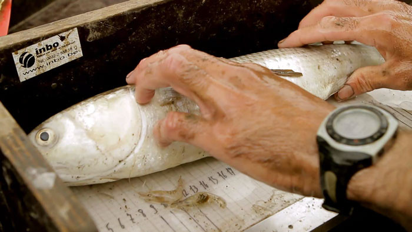\ 

###

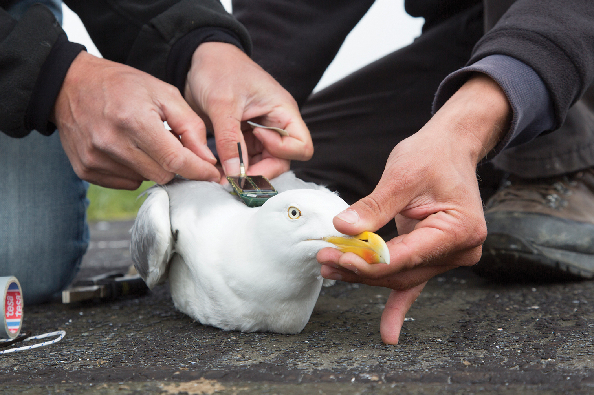\ 

###

\ 

###

\ 

## Support scientific staff in data life cycle

### Build and maintain data infrastructure

- Manage major data systems
- Setup data warehouses for uniform data access
- Setup GIS services
- Design data models for new systems
- Coordinate development of new data collection tools

### Provide research software

- Data processing tools
- GIS tools
- Reporting tools

### Example: WUG

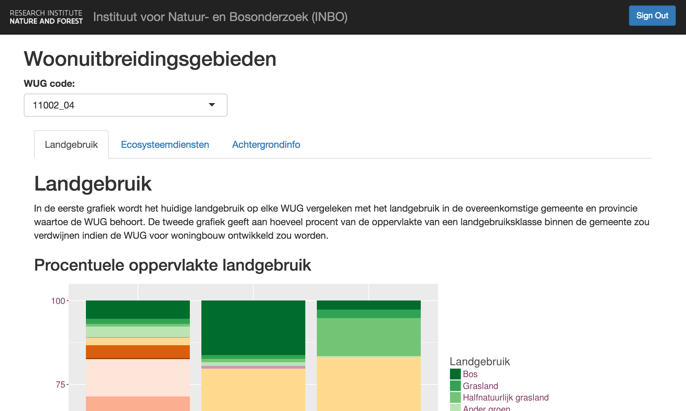\ 

### Example: WUG

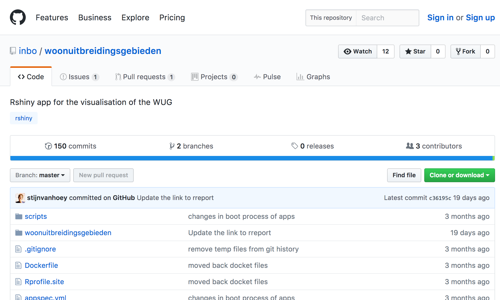\ 

### Provide support

- Documentation
- Tutorials
- Training
- Ad hoc support

## Open data

### INBO is an open data institute

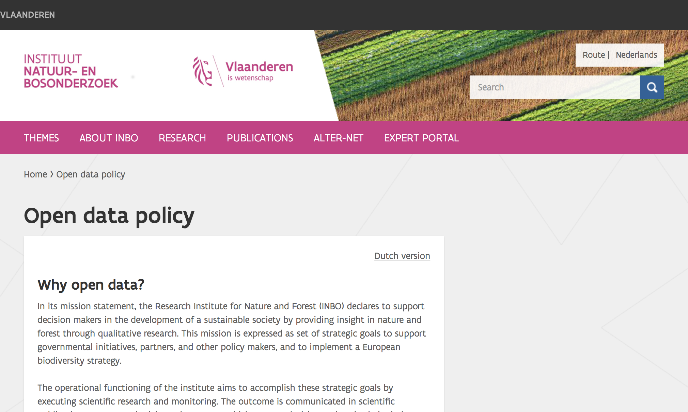\ 

### 

But what does that mean and how did we get there?

#### The Open Definition

Open data and content can be **freely used, modified, and shared** by **anyone** for **any purpose**.

### Considered open if following requirements are met

> 1. With open license or status
> 2. Accessible
> 3. Machine readable
> 4. In open format

### Why open data for research?

> - Increase discoverability
> - Increase potential use
> - Increase collaborations
> - Transparent science

### Move towards open data

> - EC: Directive on the re-use of public sector information (2003/98/EG & 2013/37/EU)
> - Flemish government: open data should become the norm for the Flemish government (_2011 conceptnota open data_)
> - Funding agencies: e.g. Horizon 2020
> - Research journals: deposit data in an open respository

### 2009

Strategic goal to manage and disclose (biodiversity) data

### 2011: First dataset published on GBIF

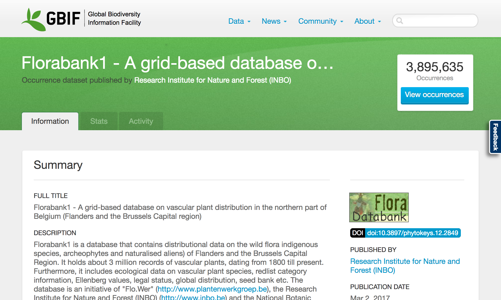\ 

### Global Biodiversity Information Facility (GBIF)

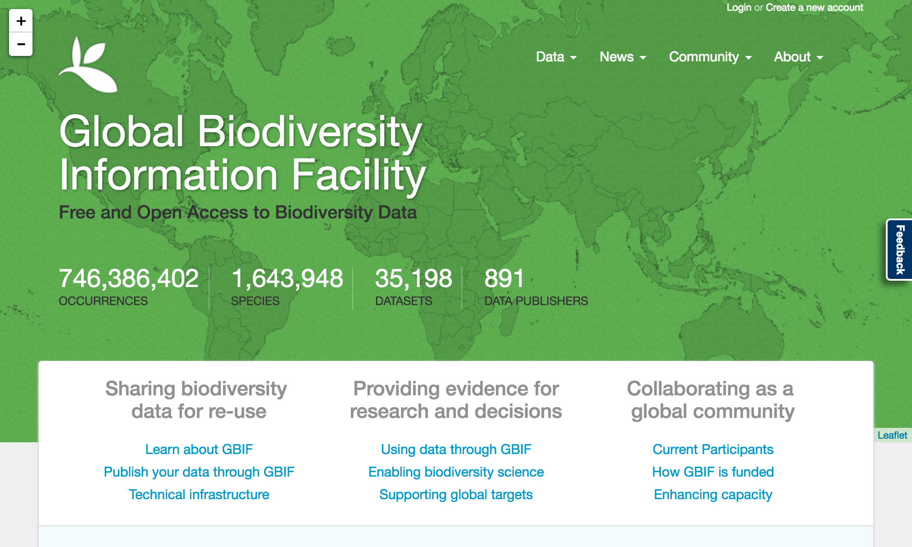\ 

### Data publication process

- Format data to international Darwin Core standard
- Document data with metadata (also standardized)
- Publish dataset online
- Register dataset with GBIF
- (Re)publish versioned updates or corrections

### 2012: First data paper

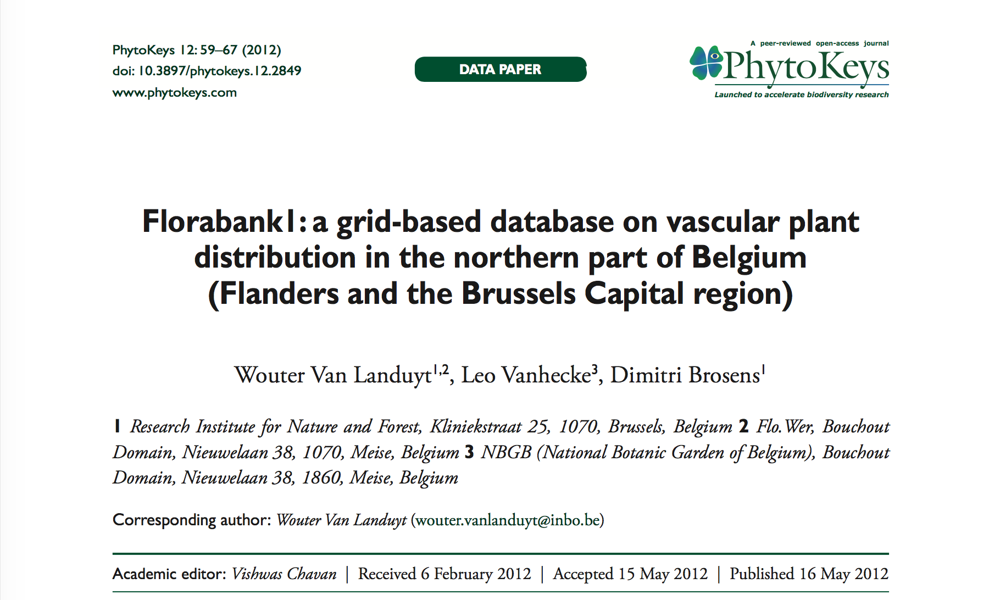\ 

### 2012: Start of the LifeWatch project

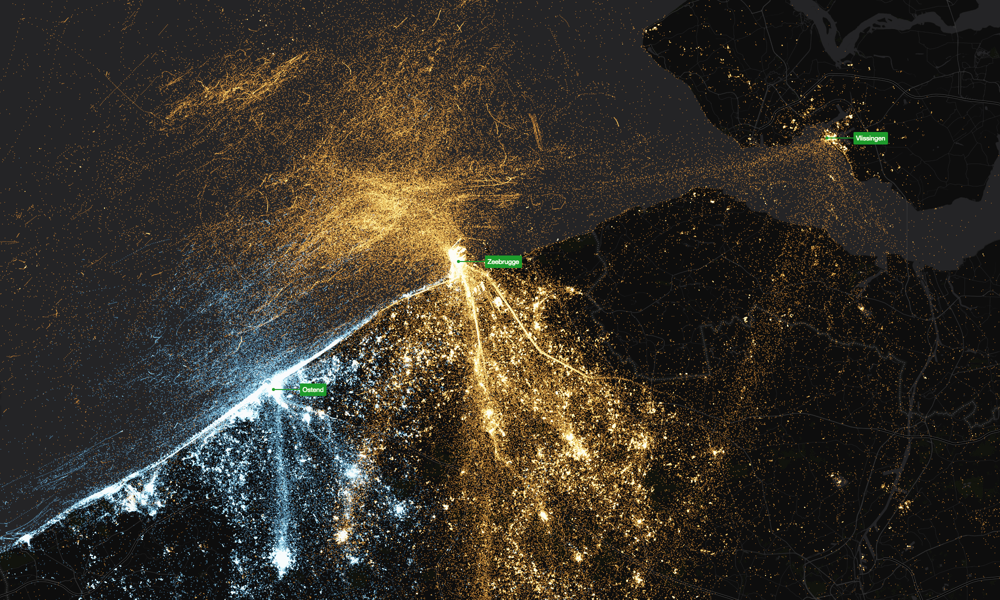\ 

### 2013: Choose a license


### 2013: GBIF license consultation

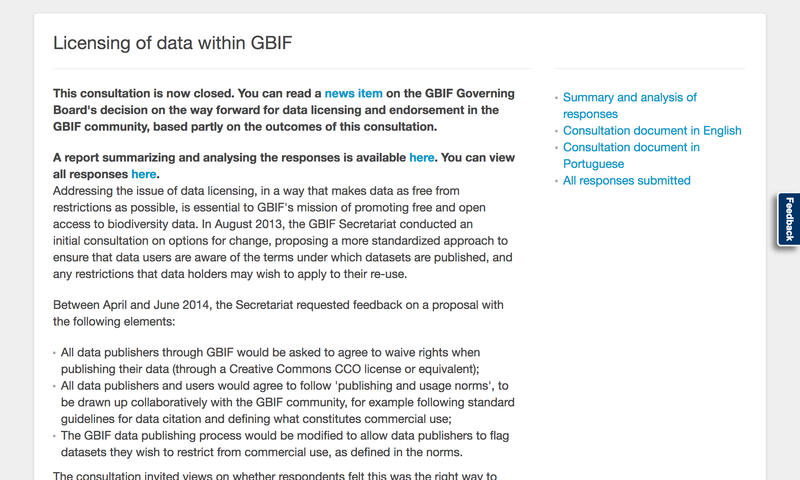\ 

### 2014: Bouchout declaration

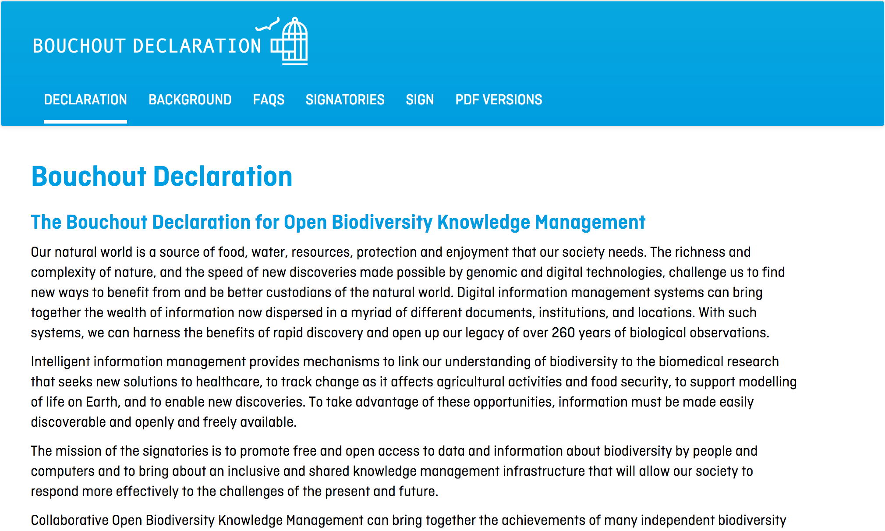\ 

### 2014: Biological Valuation Map (BVM) as open data

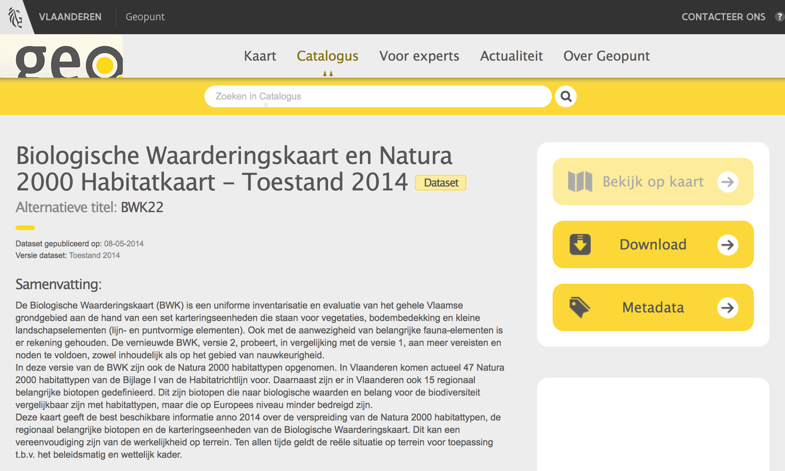\ 

### 2015: INBO open data policy

\ 

### Guidelines of the open data policy

> 1. Policy applies to data we own & is bound by legal exceptions
> 2. Data is eligible for publication 12 months after collecting
> 3. Aim to publish collected data (from major data systems)
> 4. Aim to publish result data (associated with publications)
> 5. Publish as open data (defined by Open Definition)
> 6. Publish under CC0 waiver
> 7. Encourage proper use with INBO norms for data use
> 8. Document data with metadata
> 9. Start using data management plans (DMP)

### INBO on GBIF

\ 

### Published data

```{r published}
data.frame(
  published_years = c(2011, 2012, 2013, 2014, 2015, 2016),
  published_datasets = c(2, 6, 13, 17, 20, 27),
  published_occurrences = c(3325224, 3478955, 4009432, 5191428, 7682739, 10203633) / 1e6
) %>%
  ggplot(aes(x = published_datasets, y = published_occurrences, label = published_years)) +
  geom_point() +
  geom_text(vjust = -.1, hjust = -.1, size = 2) +
  scale_x_continuous("Number of published datasets", limits = c(0, NA), expand = c(0.07, 0)) +
  scale_y_continuous("Number of published occurrences (in millions)", limits = c(0, NA))
```

### Use of data

```{r downloaded}
data.frame(
  downloaded_years = c(2013, 2014, 2015, 2016),
  downloaded_downloads = c(2091, 11206, 15382, 17974) / 1e3,
  downloaded_occurrences = c(504549089, 1603418177, 2764760091, 4178367077) / 1e9
) %>%
  ggplot(aes(x = downloaded_downloads, y = downloaded_occurrences, label = downloaded_years)) +
  geom_point() +
  geom_text(vjust = -.1, hjust = -.1, size = 2) +
  scale_x_continuous("Number of downloads (in thousands)", limits = c(0, NA), expand = c(0.07, 0)) +
  scale_y_continuous("Number of downloaded occurrences (in billions)", limits = c(0, NA))
```

### Flemish open data portal

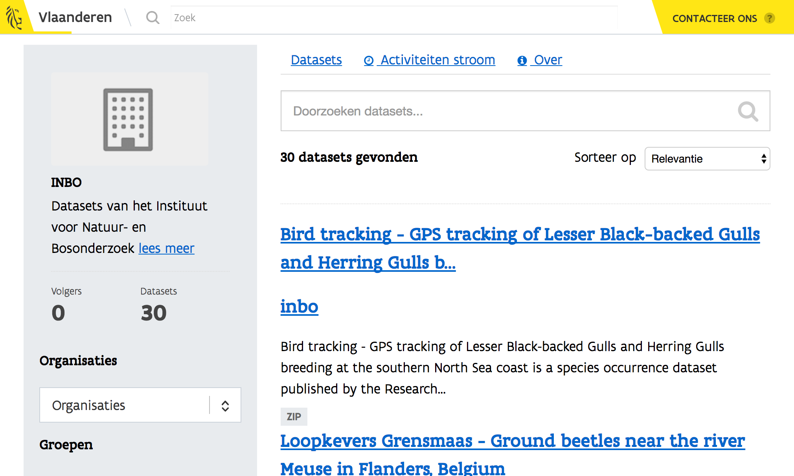\ 

### Open documentation on GitHub

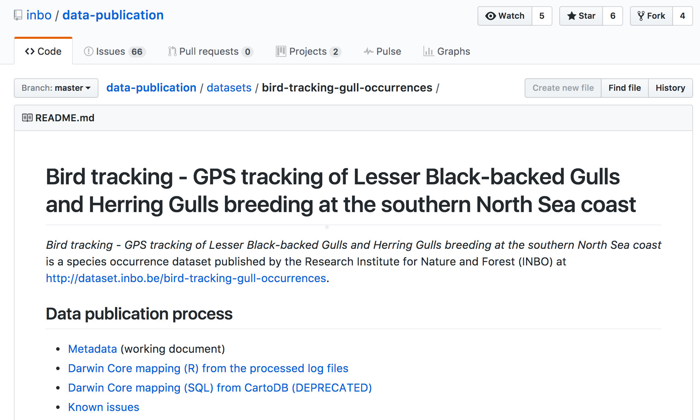\ 

### Challenges

- International platforms/standards for abiotic data
- Publish data associated with scientific publications and reports
- Automate workflows
- Think about data publication at the start of the project

# Biometry, Methodology & Quality assurance

## Methodological support

###

#### Sir Ronald Aylmer Fisher

To call in the statistician after the experiment is done may be no more than asking him to perform a post-mortem examination: he may be able to say what the experiment died of.

### Partner during the entire lifecycle of research

```{r paper}
dataset <- frame_data(
  ~Title, ~X, ~Y, ~Hjust, ~Vjust, ~Step, ~Bullets,
  "Knowledge", 0, 1.5, 0.5, 0.5, -1, "",
  "Data", 0, -1.5, 0.5, 0.5, -1, "",
  "Design", 1.5, 0, 0.5, 0.5, -1, "",
  "Inference", -1.5, 0, 0.5, 0.5, -1, "",
  "Discussion", -1.2, 1.2, 0, 1, 4,
"- Interpretation of results
- Scope of the model
- Validity of research
- Policy recommendations
- Policy tools",
  "Introduction", 0.2, 1.2,  0, 1, 1,
"- Concept
- Hypothesis
- Motivation",
  "Materials & Methods", 0.2, -0.1,  0, 1, 2,
"- Design
- Sampling
- Sample size
- Field protocol
- Statistical analysis",
  "Results", -1.2, -0.1,  0, 1, 3,
"- Good statistical practices
- Technical support
- Statistical interpretation"
) 
dataset %>%
  mutate(
    Bullets = ifelse(Step <= -1, Bullets, ""),
    Title = ifelse(Step == -1, NA, Title)
  ) %>%
  ggplot(aes(x = X, y = Y)) +
  geom_text(aes(label = Bullets, y = Y - 0.3), hjust = 0, vjust = 1, size = 2.3, colour = inbo.hoofd) +
  geom_label(
    aes(label = Title, hjust = Hjust, vjust = Vjust, colour = Step == -1), 
    size = 3, 
    show.legend = FALSE
  ) +
  theme_blank() +
  scale_x_continuous(expand = c(0.1, 0)) +
  ylim(-1.5, 1.5)
```

### Partner during the entire lifecycle of research

```{r paper0}
dataset %>%
  mutate(Bullets = ifelse(Step <= 0, Bullets, "")) %>%
  ggplot(aes(x = X, y = Y)) +
  geom_vline(xintercept = 0, linetype = 2) +
  geom_hline(yintercept = 0, linetype = 2) +
  geom_text(aes(label = Bullets, y = Y - 0.3), hjust = 0, vjust = 1, size = 2.3, colour = inbo.hoofd) +
  geom_label(
    aes(label = Title, hjust = Hjust, vjust = Vjust, colour = Step == -1), 
    size = 3, 
    show.legend = FALSE
  ) +
  theme_blank() +
  scale_x_continuous(expand = c(0.1, 0)) +
  ylim(-1.5, 1.5)
```

### Partner during the entire lifecycle of research

```{r paper1}
dataset %>%
  mutate(Bullets = ifelse(Step <= 1, Bullets, "")) %>%
  ggplot(aes(x = X, y = Y)) +
  geom_vline(xintercept = 0, linetype = 2) +
  geom_hline(yintercept = 0, linetype = 2) +
  geom_text(aes(label = Bullets, y = Y - 0.3), hjust = 0, vjust = 1, size = 2.3, colour = inbo.hoofd) +
  geom_label(
    aes(label = Title, hjust = Hjust, vjust = Vjust, colour = Step == -1), 
    size = 3, 
    show.legend = FALSE
  ) +
  theme_blank() +
  scale_x_continuous(expand = c(0.1, 0)) +
  ylim(-1.5, 1.5)
```

### Partner during the entire lifecycle of research

```{r paper2}
dataset %>%
  mutate(Bullets = ifelse(Step <= 2, Bullets, "")) %>%
  ggplot(aes(x = X, y = Y)) +
  geom_vline(xintercept = 0, linetype = 2) +
  geom_hline(yintercept = 0, linetype = 2) +
  geom_text(aes(label = Bullets, y = Y - 0.3), hjust = 0, vjust = 1, size = 2.3, colour = inbo.hoofd) +
  geom_label(
    aes(label = Title, hjust = Hjust, vjust = Vjust, colour = Step == -1), 
    size = 3, 
    show.legend = FALSE
  ) +
  theme_blank() +
  scale_x_continuous(expand = c(0.1, 0)) +
  ylim(-1.5, 1.5)
```

### Partner during the entire lifecycle of research

```{r paper3}
dataset %>%
  mutate(Bullets = ifelse(Step <= 3, Bullets, "")) %>%
  ggplot(aes(x = X, y = Y)) +
  geom_vline(xintercept = 0, linetype = 2) +
  geom_hline(yintercept = 0, linetype = 2) +
  geom_text(aes(label = Bullets, y = Y - 0.3), hjust = 0, vjust = 1, size = 2.3, colour = inbo.hoofd) +
  geom_label(
    aes(label = Title, hjust = Hjust, vjust = Vjust, colour = Step == -1), 
    size = 3, 
    show.legend = FALSE
  ) +
  theme_blank() +
  scale_x_continuous(expand = c(0.1, 0)) +
  ylim(-1.5, 1.5)
```

### Partner during the entire lifecycle of research

```{r paper4}
dataset %>%
  ggplot(aes(x = X, y = Y)) +
  geom_vline(xintercept = 0, linetype = 2) +
  geom_hline(yintercept = 0, linetype = 2) +
  geom_text(aes(label = Bullets, y = Y - 0.3), hjust = 0, vjust = 1, size = 2.3, colour = inbo.hoofd) +
  geom_label(
    aes(label = Title, hjust = Hjust, vjust = Vjust, colour = Step == -1), 
    size = 3, 
    show.legend = FALSE
  ) +
  theme_blank() +
  scale_x_continuous(expand = c(0.1, 0)) +
  ylim(-1.5, 1.5)
```

### Acquisition, development and maintainance of methodologies

> - Concept for setting up long term monitoring
> - Field protocols
> - Novel statistical techniques
> - Automation of recurring analyses
> - Traceability of analyses

## Statistical support

### Provide tools to improve open and reproducible statistical analysis

> - R
> - scripted analysis
> - version control
> - dynamic documents
> - corporate identity styles for graphics and dynamic documents

### Freeware open source software

```{r wordcloud}
set.seed(123)
cloud <- frame_data(
  ~words, ~freq,
  "R", 50,
  "RStudio", 25,
  "Markdown", 25,
  "GitHub", 25,
  "ggplot2", 10,
  "dplyr", 10,
  "tidyr", 10,
  "DBI", 3,
  "sp", 3,
  "rgeos", 3,
  "rgdal", 3,
  "INBOmd", 5,
  "INBOtheme", 5,
  "multimput", 5,
  "devtools", 5,
  "INLA", 5,
  "lme4", 5,
  "vegan", 5,
  "ggmap", 3,
  "leaflet", 3,
  "googlesheets", 3,
  "gstat", 3,
  "nlme", 5, 
  "lintr", 3,
  "covr", 3,
  "lubridate", 3,
  "mgcv", 5,
  "multcomp", 3,
  "knitr", 5,
  "raster", 3,
  "readr", 5,
  "readxl", 5,
  "testthat", 3
)
wordcloud(
  words = cloud$words,
  freq = cloud$freq,
  random.color = TRUE,
  colors = inbo.2015.colours(9)
)
```


### Improve statistical skills of scientific staff

\ 

## Statistical expertise

###

#### George E. P. Box

All models are wrong, but some are useful.

### Power calculation


### Data validation through statistical modelling

```{r tree}
dataset <- read.csv("tree.csv") %>%
  mutate(lc130 = log(c130 / 100))
model <- lmer(
  height ~ poly(lc130, 2) + (poly(lc130, 2) | location),
  data = dataset
)
dataset <- dataset %>%
  mutate(
    fit = fitted(model),
    residual = residuals(model),
    rank = n() - min_rank(abs(residual))
  )
max_rank <- 27
relevant <- dataset %>%
  filter(rank <= max_rank) %>%
  distinct(location) 
dataset %>%
  semi_join(relevant, by = "location") %>%
  mutate(
    anomaly = rank <= max_rank
  ) %>%
  arrange(desc(rank)) %>%
  ggplot(aes(x = c130, y = height)) +
  geom_jitter(
    aes(colour = anomaly), 
    position = position_jitter(width = 5, height = 0)
  ) +
  geom_line(aes(y = fit)) +
  facet_wrap(~location) +
  xlab("Circumference at 130 cm (cm)") +
  ylab("Tree height (m)") +
  scale_colour_manual(
    "Anomaly", 
    values = c("FALSE" = inbo.steun.geelgroen, "TRUE" = inbo.hoofd)
  )
```

### Methods that strike a good balance between observer error, sampling error and costs

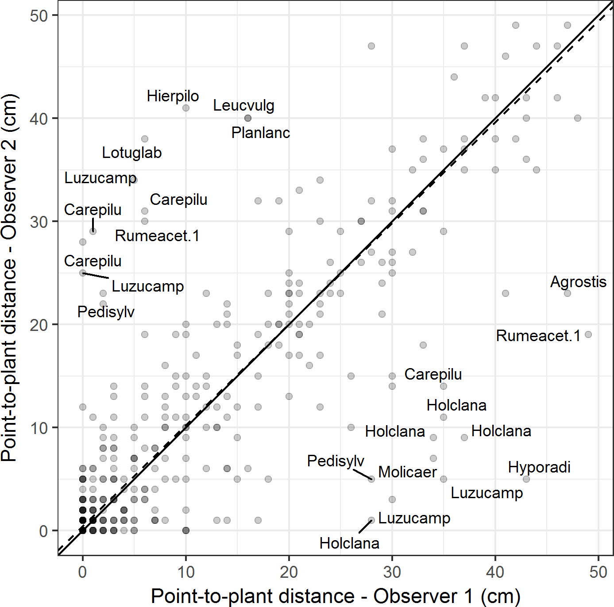


# Towards supporting policy with open reproducible science

### Rome wasn't built in a day

> - Gradual change is key for success
> - Focus on early adopters and early majority
> - Stimulation and support is vital
> - New procedures should lower the burden in the long run
> - Allow for a long transition period before enforcing change

## Designing and evaluating long term monitoring

###

#### John Tukey

The combination of some data and an aching desire for an answer does not ensure that a reasonable answer can be extracted from a given body of data.

### 5 stages of preparing long term monitoring

```{r guidebook}
theme_set(theme_inbo(6, transparent = TRUE))
z <- 0.6
texts <- data.frame(
  phase = 0:5,
  label = c(
"vague
information
requirements", 
"Phase I
supply and demand", 
"Phase II
design
data collection", 
"Phase III
design
data management
data analysis", 
"Phase IV
design
reporting
communication", 
"Phase V
implementation"
    ),
  x = c(-1.5, -z, 0,  z,  0, 1.5),
  y = c(   0,  0, z,  0, -z, 0)
)
shapes <- bind_rows(
  expand.grid(
    phase = 1:4,
    x = 0,
    y = 0
  ),
  expand.grid(
    phase = 1:4,
    angle = seq(-0.5, 0.5, length = 41) * pi / 3 + pi
  ) %>%
  mutate(
    angle = angle - (phase - 1) * pi / 2,
    x = cos(angle),
    y = sin(angle)
  ),
  expand.grid(
    phase = 1:4,
    x = 0,
    y = 0
  ),
  data.frame(
    phase = 0,
    x = c(-1.2, -1.2, -1.8, -1.8, -1.2),
    y = c(-0.3, 0.3, 0.3, -0.3, -0.3)
  ),
  data.frame(
    phase = 5,
    x = c(1.2, 1.2, 1.8, 1.8, 1.2),
    y = c(-0.3, 0.3, 0.3, -0.3, -0.3)
  )
)
rad <- 0.8
arrows <- data.frame(
  phase = 1:4
) %>%
  mutate(
    start = 0.5 * pi / 3 + (phase - 1) * pi / 2,
    end = -0.5 * pi / 3 + phase * pi / 2,
    x = cos(start) * rad,
    y = sin(start) * rad,
    xend = cos(end) * rad,
    yend = sin(end) * rad
  )
triple_arrows <- expand.grid(
  place = c(-1, 1),
  extra = c(-1, 0, 1)
) %>%
  mutate(
    x = pmin(place, place * 1.2),
    xend = pmax(place, place * 1.2),
    y = extra * 0.1,
    yend = extra * 0.1
  )
ggplot(shapes, aes(x = x, y = y)) +
  geom_path(aes(group = phase)) +
  geom_segment(
    data = triple_arrows, 
    aes(xend = xend, yend = yend), 
    arrow = arrow(length = unit(2, "mm"), type = "closed")
  ) +
  geom_segment(
    data = arrows, 
    aes(xend = xend, yend = yend), 
    arrow = arrow(ends = "both", length = unit(2, "mm"))
  ) +
  geom_text(data = texts, aes(label = label), size = 2) +
  coord_fixed() + 
  theme_blank()
```

### Focus on the relevant questions

```{r guidebook0}
shapes %>%
  mutate(background = phase == 0) %>%
  ggplot(aes(x = x, y = y)) +
  geom_polygon(aes(group = phase, fill = background), show.legend = FALSE) +
  geom_segment(
    data = triple_arrows, 
    aes(xend = xend, yend = yend), 
    arrow = arrow(length = unit(2, "mm"), type = "closed")
  ) +
  geom_segment(
    data = arrows, 
    aes(xend = xend, yend = yend), 
    arrow = arrow(ends = "both", length = unit(2, "mm"))
  ) +
  geom_text(data = texts, aes(label = label), size = 2) +
  coord_fixed() + 
  scale_fill_manual(values = c("TRUE" = inbo.steun.geelgroen, "FALSE" = NA)) +
  theme_blank()
```

### Prioritise the questions

```{r guidebook1}
shapes %>%
  mutate(background = phase == 1) %>%
  ggplot(aes(x = x, y = y)) +
  geom_polygon(aes(group = phase, fill = background), show.legend = FALSE) +
  geom_segment(
    data = triple_arrows, 
    aes(xend = xend, yend = yend), 
    arrow = arrow(length = unit(2, "mm"), type = "closed")
  ) +
  geom_segment(
    data = arrows, 
    aes(xend = xend, yend = yend), 
    arrow = arrow(ends = "both", length = unit(2, "mm"))
  ) +
  geom_text(data = texts, aes(label = label, colour = phase == 1), size = 2, show.legend = FALSE) +
  scale_colour_manual(values = c("TRUE" = inbo.bruinrood, "FALSE" = inbo.steun.blauw)) +
  coord_fixed() + 
  scale_fill_manual(values = c("TRUE" = inbo.steun.geelgroen, "FALSE" = NA)) +
  theme_blank()
```

### Scenarios based on power and cost 

```{r guidebook2}
shapes %>%
  mutate(background = phase == 2) %>%
  ggplot(aes(x = x, y = y)) +
  geom_polygon(aes(group = phase, fill = background), show.legend = FALSE) +
  geom_segment(
    data = triple_arrows, 
    aes(xend = xend, yend = yend), 
    arrow = arrow(length = unit(2, "mm"), type = "closed")
  ) +
  geom_segment(
    data = arrows, 
    aes(xend = xend, yend = yend), 
    arrow = arrow(ends = "both", length = unit(2, "mm"))
  ) +
  geom_text(data = texts, aes(label = label, colour = phase == 2), size = 2, show.legend = FALSE) +
  scale_colour_manual(values = c("TRUE" = inbo.bruinrood, "FALSE" = inbo.steun.blauw)) +
  coord_fixed() + 
  scale_fill_manual(values = c("TRUE" = inbo.steun.geelgroen, "FALSE" = NA)) +
  theme_blank()
```

### From raw data to final results \vphantom{y}

```{r guidebook3}
shapes %>%
  mutate(background = phase == 3) %>%
  ggplot(aes(x = x, y = y)) +
  geom_polygon(aes(group = phase, fill = background), show.legend = FALSE) +
  geom_segment(
    data = triple_arrows, 
    aes(xend = xend, yend = yend), 
    arrow = arrow(length = unit(2, "mm"), type = "closed")
  ) +
  geom_segment(
    data = arrows, 
    aes(xend = xend, yend = yend), 
    arrow = arrow(ends = "both", length = unit(2, "mm"))
  ) +
  geom_text(data = texts, aes(label = label, colour = phase == 3), size = 2, show.legend = FALSE) +
  scale_colour_manual(values = c("TRUE" = inbo.bruinrood, "FALSE" = inbo.steun.blauw)) +
  coord_fixed() + 
  scale_fill_manual(values = c("TRUE" = inbo.steun.geelgroen, "FALSE" = NA)) +
  theme_blank()
```

### What to communicate \vphantom{y}

```{r guidebook4}
shapes %>%
  mutate(background = phase == 4) %>%
  ggplot(aes(x = x, y = y)) +
  geom_polygon(aes(group = phase, fill = background), show.legend = FALSE) +
  geom_segment(
    data = triple_arrows, 
    aes(xend = xend, yend = yend), 
    arrow = arrow(length = unit(2, "mm"), type = "closed")
  ) +
  geom_segment(
    data = arrows, 
    aes(xend = xend, yend = yend), 
    arrow = arrow(ends = "both", length = unit(2, "mm"))
  ) +
  geom_text(data = texts, aes(label = label, colour = phase == 4), size = 2, show.legend = FALSE) +
  scale_colour_manual(values = c("TRUE" = inbo.bruinrood, "FALSE" = inbo.steun.blauw)) +
  coord_fixed() + 
  scale_fill_manual(values = c("TRUE" = inbo.steun.geelgroen, "FALSE" = NA)) +
  theme_blank()
```

### Aspects we can make open? \vphantom{y}

```{r guidebook5}

open_science_texts <- data.frame(
  phase = c(
"vague
information
requirements", 
"Phase I
supply and demand", 
"Phase II
open methodology
open collected data", 
"Phase III
open methodology
open source analysis scripts", 
"Phase IV
open access reports
open result data", 
"Phase V
implementation"
    ),
  x = c(-1.5, -z, 0,  z,  0, 1.5),
  y = c(   0,  0, z,  0, -z, 0)
)

shapes %>%
  mutate(background = phase == 0) %>%
  ggplot(aes(x = x, y = y)) +
  geom_polygon(aes(group = phase, fill = background), show.legend = FALSE) +
  geom_segment(
    data = triple_arrows, 
    aes(xend = xend, yend = yend), 
    arrow = arrow(length = unit(2, "mm"), type = "closed")
  ) +
  geom_segment(
    data = arrows, 
    aes(xend = xend, yend = yend), 
    arrow = arrow(ends = "both", length = unit(2, "mm"))
  ) +
  geom_text(data = open_science_texts, aes(label = phase), size = 2) +
  coord_fixed() + 
  scale_fill_manual(values = c("TRUE" = inbo.steun.geelgroen, "FALSE" = NA)) +
  theme(
    axis.title = element_blank(),
    axis.text = element_blank(),
    axis.ticks = element_blank(),
    panel.background = element_blank(),
    panel.grid = element_blank()
  )
```

### We're almost ready to rock'n roll \vphantom{y}

```{r guidebook6}
shapes %>%
  mutate(background = phase == 5) %>%
  ggplot(aes(x = x, y = y)) +
  geom_polygon(aes(group = phase, fill = background), show.legend = FALSE) +
  geom_segment(
    data = triple_arrows, 
    aes(xend = xend, yend = yend), 
    arrow = arrow(length = unit(2, "mm"), type = "closed")
  ) +
  geom_segment(
    data = arrows, 
    aes(xend = xend, yend = yend), 
    arrow = arrow(ends = "both", length = unit(2, "mm"))
  ) +
  geom_text(data = texts, aes(label = label, colour = phase == 5), size = 2, show.legend = FALSE) +
  scale_colour_manual(values = c("TRUE" = inbo.bruinrood, "FALSE" = inbo.steun.blauw)) +
  coord_fixed() + 
  scale_fill_manual(values = c("TRUE" = inbo.steun.geelgroen, "FALSE" = NA)) +
  theme_blank()
```
