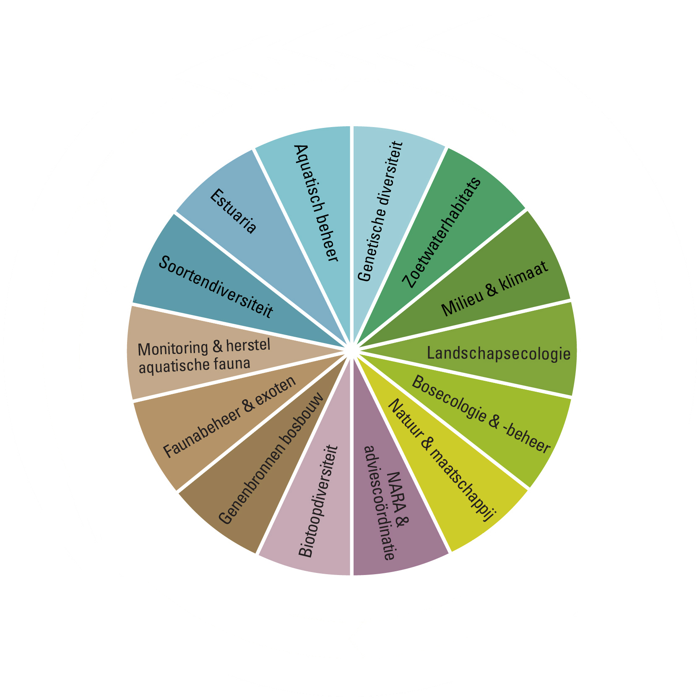
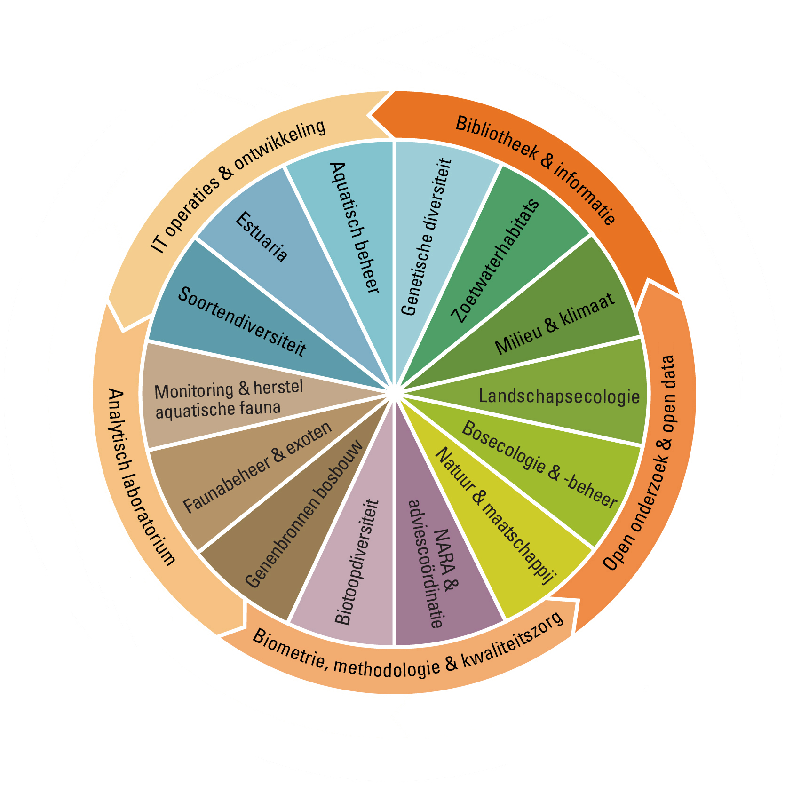
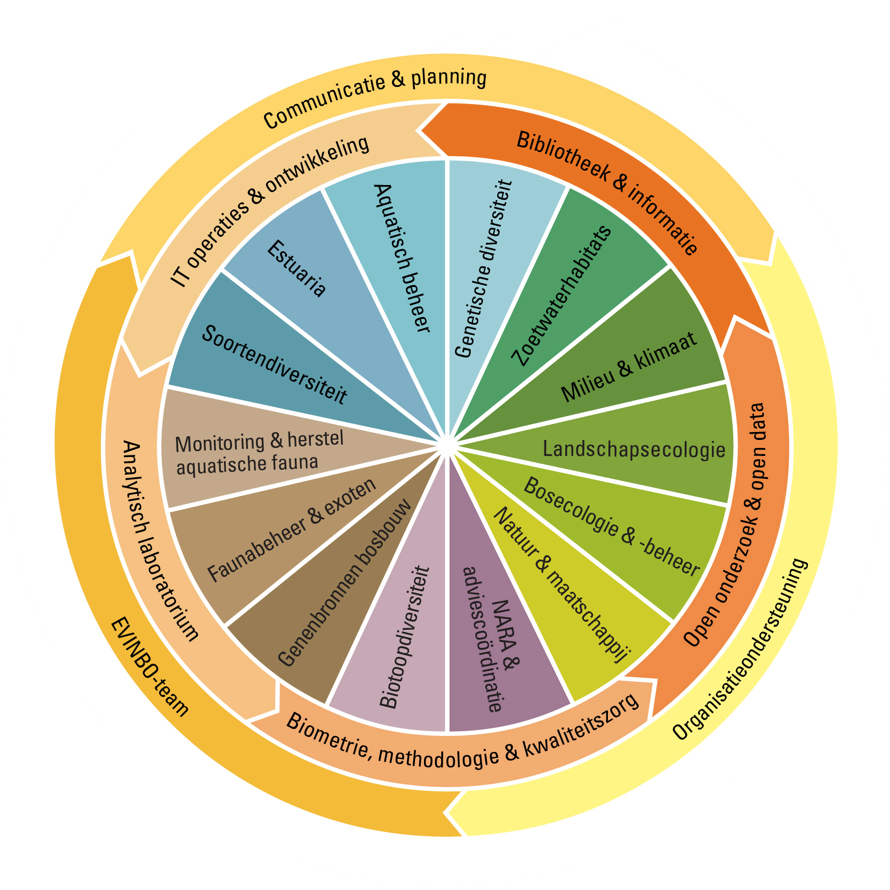
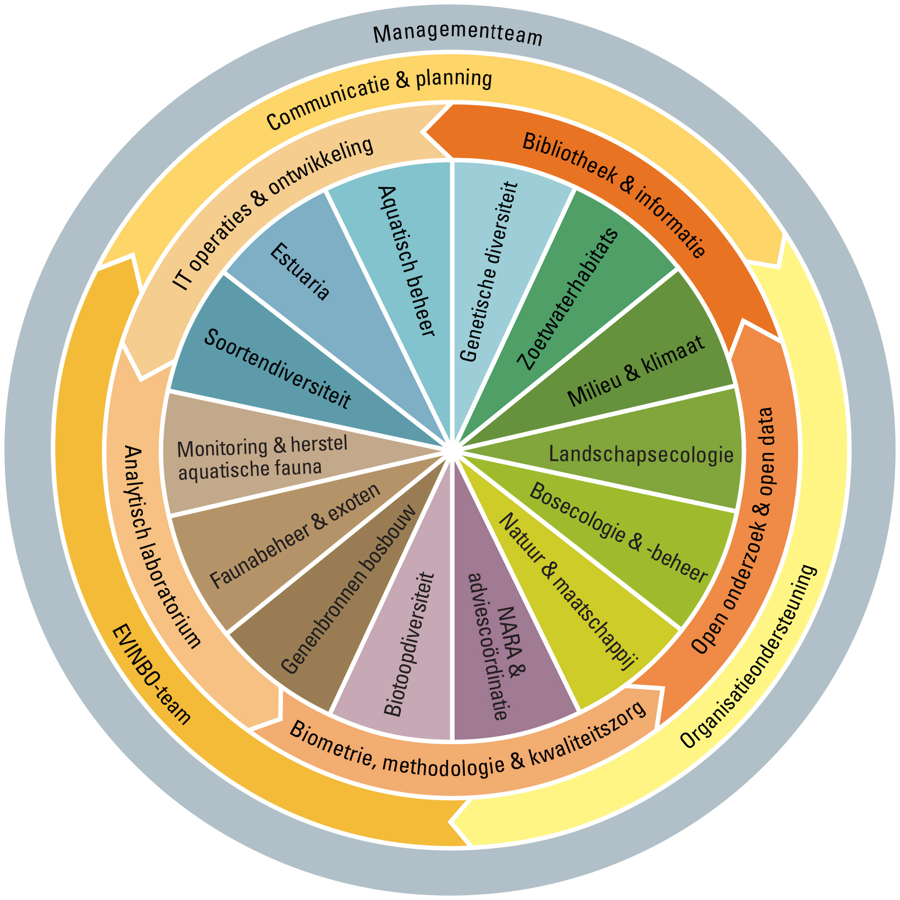
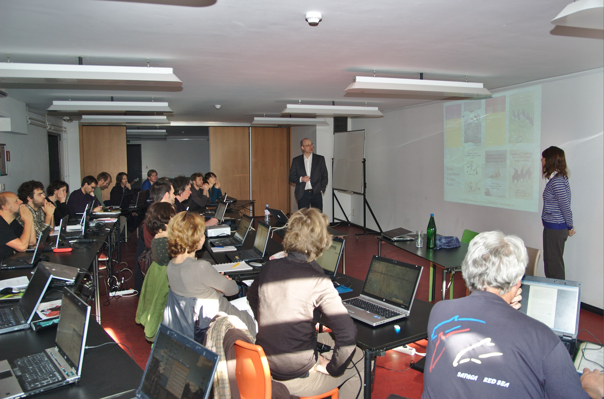
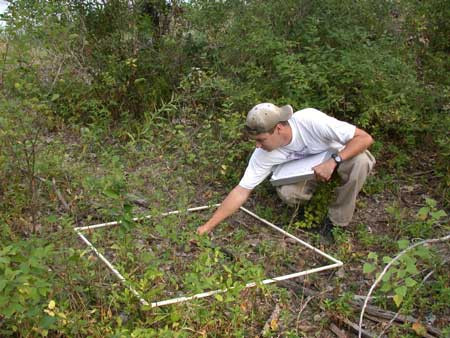

```{r include = FALSE}
library(knitr)
opts_chunk$set(
  echo = FALSE,
  cache = TRUE,
  autodep = TRUE
)
library(lme4)
library(dplyr)
library(ggplot2)
library(INBOtheme)
theme_set(theme_inbo2015(6))
update_geom_defaults("point", list(size = 0.5))
update_geom_defaults("line", list(size = 0.2))
```

```{r}
staff <- 262
admin <- 22
management <- 9
wo <- c(BMK = 8, Data = 8, ICT = 6, Lab = 10, Bib = 8)
science <- staff - admin - sum(wo) - management
```

# Who are we?


### Instituut voor Natuur- en Bosonderzoek (INBO)

> - Research Institute for Nature and Forest
> - Flemish government
> - research and knowledge center
> - topics: nature conservation, forestry, hunting
> - target audience: **policy makers** and stakeholders
> - provides data for **international reporting**
> - part of international research networks: LTER, LifeWatch, ALTER-net, ...

### 14 teams scientific staff (`r science` members)

\ 

### 5 teams in support of scientific staff (`r sum(wo)` members)

\ 

### 3 administrative teams (`r admin` members)

\ 

### 1 management team (`r management` members)

\ 

# Biometry, Methodology & Quality assurance

## Statistical support

### Provide tools to improve open and reproducible statistical analysis

> - R
> - scripted analysis
> - version control
> - dynamic documents
> - corporate identity styles for graphics and dynamic documents

### Improve statistical skills of scientific staff

\ 

## Methodological support

### Partner during the entire life cycle of research

> - Refine hypotheses
> - Experimental design
> - Statistical analysis
> - Report results

### Acquisition, development and maintainance of methodologies

> - Concept for setting up long term monitoring
> - Field protocols
> - Novel statistical techniques
> - Automation of recurring analyses
> - Traceablity of analyses
> - Recommended suite of software and tools

## Statistical expertise

### Data validation through statistical modelling

```{r}
dataset <- read.csv("tree.csv") %>%
  mutate(lc130 = log(c130 / 100))
model <- lmer(
  height ~ poly(lc130, 2) + (poly(lc130, 2) | location),
  data = dataset
)
dataset <- dataset %>%
  mutate(
    fit = fitted(model),
    residual = residuals(model),
    rank = n() - min_rank(abs(residual))
  )
max_rank <- 27
relevant <- dataset %>%
  filter(rank <= max_rank) %>%
  distinct(location) 
dataset %>%
  semi_join(relevant, by = "location") %>%
  mutate(
    anomaly = rank <= max_rank
  ) %>%
  arrange(desc(rank)) %>%
  ggplot(aes(x = c130, y = height)) +
  geom_jitter(
    aes(colour = anomaly), 
    position = position_jitter(width = 5, height = 0)
  ) +
  geom_line(aes(y = fit)) +
  facet_wrap(~location) +
  xlab("Circumference at 130 cm (cm)") +
  ylab("Tree height (m)") +
  scale_colour_manual(
    "Anomaly", 
    values = c("FALSE" = inbo.steun.geelgroen, "TRUE" = inbo.hoofd)
  )
```

### Distance based estimates of vegetation cover

\ 

# Open data & open research

# Vision on transparant policy supporting research
