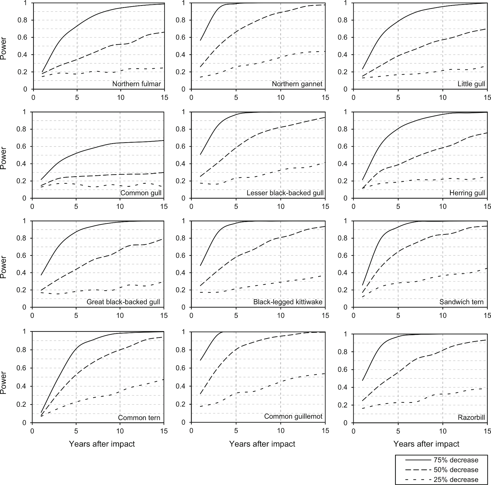

--- 
title: "Voorbeeldslides met INBOmd"
author: "Thierry Onkelinx"
site: bookdown::bookdown_site
output:
  bookdown::pdf_book:
    base_format: INBOmd::inbo_slides
    subtitle: "Hier komt de optionele ondertitel"
    location: "Hier komt optioneel de plaats"
    institute: "Hier komt optioneel de affiliatie"
    toc: FALSE
    slide_level: 1
---

```{r include = FALSE}
library(knitr)
opts_chunk$set(
  echo = FALSE,
  cache = TRUE,
  autodep = TRUE,
  dev = c("png", "pdf")
)
library(dplyr)
library(lme4)
library(ggplot2)
library(INBOtheme)
theme_set(theme_inbo(6))
update_geom_defaults("point", list(size = 0.5))
update_geom_defaults("line", list(size = 0.2))
update_geom_defaults("path", list(size = 0.2))
update_geom_defaults("text", list(size = 2))
theme_blank <- function(){
  theme(
    axis.title = element_blank(),
    axis.text = element_blank(),
    axis.ticks = element_blank(),
    panel.background = element_blank(),
    panel.grid = element_blank()
  )
}
```

# Biometrie methodologie & kwaliteitszorg

- Biometrie
    - State-of-the-art statistiek door eigen experts
    - Zorgen voor goede basiskennis statistiek wetenschappers
- Methodologie
    - Concept voor opzet langetermijnmonitoring
    - Vergelijken van meetnetscenarios op basis van informatieinhoud en kosten
- Kwaliteitszorg
    - Veldprotocols
    - Traceerbare statistische verwerking

# Data validation through statistical modelling

```{r tree}
dataset <- read.csv("tree.csv") %>%
  mutate(lc130 = log(c130 / 100))
model <- lmer(
  height ~ poly(lc130, 2) + (poly(lc130, 2) | location),
  data = dataset
)
dataset <- dataset %>%
  mutate(
    fit = fitted(model),
    residual = residuals(model),
    rank = n() - min_rank(abs(residual))
  )
max_rank <- 27
relevant <- dataset %>%
  filter(rank <= max_rank) %>%
  distinct(location) 
dataset %>%
  semi_join(relevant, by = "location") %>%
  mutate(
    anomaly = rank <= max_rank
  ) %>%
  arrange(desc(rank)) %>%
  ggplot(aes(x = c130, y = height)) +
  geom_jitter(
    aes(colour = anomaly), 
    position = position_jitter(width = 5, height = 0)
  ) +
  geom_line(aes(y = fit)) +
  facet_wrap(~location) +
  xlab("Circumference at 130 cm (cm)") +
  ylab("Tree height (m)") +
  scale_colour_manual(
    "Anomaly", 
    values = c("FALSE" = inbo.steun.geelgroen, "TRUE" = inbo.hoofd)
  )
```

# Power calculation



# The 'good' old days

```{r oldschool, fig.height = 1}
theme_set(theme_inbo(6, transparent = TRUE))
z <- 0.6
texts <- data.frame(
  phase = 0:5,
  label = c(
"vague
information
requirements", 
"Phase I
supply and demand", 
"Phase II
design
data collection", 
"Phase III
design
data management
data analysis", 
"Phase IV
design
reporting
communication", 
"Phase V
implementation"
    ),
  label_nl = c(
"vage
informatie-
behoefte", 
"Fase I
vraag en aanbod", 
"Fase II
ontwerp
gegevens-
inzameling", 
"Fase III
ontwerp
gegevensbeheer
gegevens-
verwerking", 
"Fase IV
ontwerp
raportering
communicatie", 
"Fase V
implementatie"
    ),
  x = c(-1.5, -z, 0,  z,  0, 1.5),
  y = c(   0,  0, z,  0, -z, 0)
)
shapes <- bind_rows(
  expand.grid(
    phase = 1:4,
    x = 0,
    y = 0
  ),
  expand.grid(
    phase = 1:4,
    angle = seq(-0.5, 0.5, length = 41) * pi / 3 + pi
  ) %>%
  mutate(
    angle = angle - (phase - 1) * pi / 2,
    x = cos(angle),
    y = sin(angle)
  ),
  expand.grid(
    phase = 1:4,
    x = 0,
    y = 0
  ),
  data.frame(
    phase = 0,
    x = c(-1.2, -1.2, -1.8, -1.8, -1.2),
    y = c(-0.3, 0.3, 0.3, -0.3, -0.3)
  ),
  data.frame(
    phase = 5,
    x = c(1.2, 1.2, 1.8, 1.8, 1.2),
    y = c(-0.3, 0.3, 0.3, -0.3, -0.3)
  )
)
rad <- 0.8
arrows <- data.frame(
  phase = 1:4
) %>%
  mutate(
    start = 0.5 * pi / 3 + (phase - 1) * pi / 2,
    end = -0.5 * pi / 3 + phase * pi / 2,
    x = cos(start) * rad,
    y = sin(start) * rad,
    xend = cos(end) * rad,
    yend = sin(end) * rad
  )
triple_arrows <- expand.grid(
  extra = c(-1, 0, 1)
) %>%
  mutate(
    x = -1.2,
    xend = 1.2,
    y = extra * 0.1,
    yend = extra * 0.1
  )
shapes %>%
  filter(phase %in% c(0, 5)) %>%
ggplot(aes(x = x, y = y)) +
  geom_path(aes(group = phase)) +
  geom_segment(
    data = triple_arrows, 
    aes(xend = xend, yend = yend), 
    arrow = arrow(length = unit(2, "mm"), type = "closed")
  ) +
  geom_text(data = filter(texts, phase %in% c(0, 5)), aes(label = gsub("Phase V\n", "", label))) +
  coord_fixed() + 
  theme_blank()
```

## John Tukey

The combination of some data and an aching desire for an answer does not ensure that a reasonable answer can be extracted from a given body of data.

# 5 stages of preparing long term monitoring

```{r guidebook}
triple_arrows <- expand.grid(
  place = c(-1, 1),
  extra = c(-1, 0, 1)
) %>%
  mutate(
    x = pmin(place, place * 1.2),
    xend = pmax(place, place * 1.2),
    y = extra * 0.1,
    yend = extra * 0.1
  )
ggplot(shapes, aes(x = x, y = y)) +
  geom_path(aes(group = phase)) +
  geom_segment(
    data = triple_arrows, 
    aes(xend = xend, yend = yend), 
    arrow = arrow(length = unit(2, "mm"), type = "closed")
  ) +
  geom_segment(
    data = arrows, 
    aes(xend = xend, yend = yend), 
    arrow = arrow(ends = "both", length = unit(2, "mm"))
  ) +
  geom_text(data = texts, aes(label = label)) +
  coord_fixed() + 
  theme_blank()
```

# 5 stages of preparing long term monitoring

```{r leidraad}
ggplot(shapes, aes(x = x, y = y)) +
  geom_path(aes(group = phase)) +
  geom_segment(
    data = triple_arrows, 
    aes(xend = xend, yend = yend), 
    arrow = arrow(length = unit(2, "mm"), type = "closed")
  ) +
  geom_segment(
    data = arrows, 
    aes(xend = xend, yend = yend), 
    arrow = arrow(ends = "both", length = unit(2, "mm"))
  ) +
  geom_text(data = texts, aes(label = label_nl)) +
  coord_fixed() + 
  theme_blank()
```
